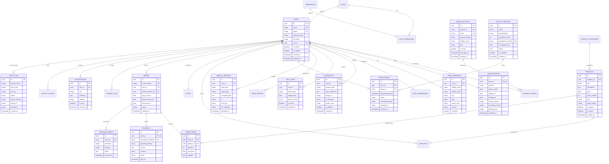

# NutriVedha — Database ER Diagram

## 1. Complete Relational Entity-Relationship Diagram

```mermaid
erDiagram
    %% Auth Service
    ROLES ||--o{ ROLE_PERMISSIONS : has
    PERMISSIONS ||--o{ ROLE_PERMISSIONS : contains
    ROLES ||--o{ USERS : assigns
    USERS ||--o{ REFRESH_TOKENS : generates
    ADMIN_ACCOUNTS ||--o{ REFRESH_TOKENS : generates

    %% User Service
    USERS ||--|| USER_PROFILES : owns
    USERS ||--o{ USER_ADDRESSES : has
    USERS ||--|| USER_PREFERENCES : configures

    %% AI Service
    USERS ||--o{ AI_REQUESTS : initiates
    USERS ||--o{ DIET_PLANS : receives
    USERS ||--o{ SAVED_RECIPES : bookmarks

    %% Medical Service
    USERS ||--o{ MEDICAL_REPORTS : uploads

    %% Telemedicine Service
    DOCTOR_PROFILES ||--o{ APPOINTMENTS : books
    USERS ||--o{ APPOINTMENTS : schedules

    %% Marketplace Service
    PRODUCT_CATEGORIES ||--o{ PRODUCTS : categorizes
    USERS ||--o{ WISHLISTS : saves
    PRODUCTS ||--o{ WISHLISTS : contained_in
    USERS ||--|| CARTS : maintains

    %% Orders Service
    USERS ||--o{ ORDERS : places
    ORDERS ||--o{ ORDER_ITEMS : contains
    PRODUCTS ||--o{ ORDER_ITEMS : referenced_in
    ORDERS ||--|| PAYMENTS : settles
    ORDERS ||--o{ TRACKING_EVENTS : progresses

    %% Fitness Service
    USERS ||--o{ FITNESS_LOGS : records

    %% Notification Service
    USERS ||--o{ NOTIFICATIONS : receives

    %% Analytics Service
    USERS ||--o{ ACTIVITY_EVENTS : emits
    USERS ||--o{ AUDIT_LOGS : records_target

    USERS {
        uuid id PK
        string email UK
        string phone UK
        string password_hash
        string full_name
        uuid role_id FK
        boolean is_active
        boolean is_verified
        timestamp created_at
        timestamp updated_at
    }

    ADMIN_ACCOUNTS {
        uuid id PK
        string username UK
        string email UK
        string password_hash
        string display_name
        string role
        boolean is_active
        timestamp last_login_at
        timestamp created_at
    }

    USER_PROFILES {
        uuid id PK
        uuid user_id FK, UK
        string gender
        date date_of_birth
        float height_cm
        float weight_kg
        string primary_dosha
        string secondary_dosha
        string blood_group
        timestamp updated_at
    }

    USER_ADDRESSES {
        uuid id PK
        uuid user_id FK
        string address_line1
        string address_line2
        string city
        string state
        string postal_code
        string country
        boolean is_default
    }

    MEDICAL_REPORTS {
        uuid id PK
        uuid user_id FK
        string report_title
        string report_type
        text encrypted_data
        string iv
        string auth_tag
        string file_reference
        timestamp uploaded_at
    }

    AI_REQUESTS {
        uuid id PK
        uuid user_id FK
        string request_type
        text input_symptoms
        string image_url
        jsonb ai_response
        string model_used
        boolean is_fallback
        timestamp created_at
    }

    DIET_PLANS {
        uuid id PK
        uuid user_id FK
        string dosha_type
        float budget_limit
        jsonb plan_structure
        boolean is_active
        timestamp created_at
    }

    DOCTOR_PROFILES {
        uuid id PK
        string name
        string specialization
        int experience_years
        string registration_number UK
        float consultation_fee
        float rating
        boolean is_available
        timestamp created_at
    }

    APPOINTMENTS {
        uuid id PK
        uuid user_id FK
        uuid doctor_id FK
        timestamp appointment_time
        string status
        string consultation_type
        string meeting_url
        timestamp created_at
    }

    PRODUCTS {
        uuid id PK
        uuid category_id FK
        string title
        text description
        float price
        int stock_quantity
        string unit
        string origin_region
        boolean is_organic
        boolean is_active
        timestamp created_at
    }

    ORDERS {
        uuid id PK
        string order_number UK
        uuid user_id FK
        uuid delivery_address_id FK
        float total_amount
        float discount_amount
        float final_amount
        string status
        timestamp created_at
    }

    ORDER_ITEMS {
        uuid id PK
        uuid order_id FK
        uuid product_id FK
        int quantity
        float unit_price
        float subtotal
    }

    PAYMENTS {
        uuid id PK
        uuid order_id FK, UK
        string transaction_reference UK
        string payment_gateway
        float amount
        string currency
        string status
        timestamp paid_at
    }

    TRACKING_EVENTS {
        uuid id PK
        uuid order_id FK
        string milestone
        string location
        text notes
        timestamp event_time
    }

    NOTIFICATIONS {
        uuid id PK
        uuid user_id FK
        string title
        text message
        string category
        boolean is_read
        timestamp created_at
    }

    AUDIT_LOGS {
        uuid id PK
        string service_name
        string actor_type
        string actor_id
        string action
        string target_resource
        string target_id
        jsonb metadata
        timestamp created_at
    }
```
